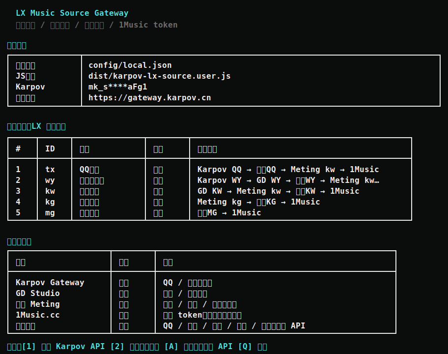

<div align="center">

# LX Music Source Gateway

**LX Music Desktop 自定义聚合音源生成器**

支持 QQ、网易云、酷我、酷狗、咪咕与本地后端 Fallback 机制。一个菜单完成主要配置。

[](https://linux.do/)
[](https://linux.do/)
[](LICENSE)

</div>

---

## 核心特性 / 适合谁用

- **多源聚合**：将 Karpov Gateway、GD Studio、妖狐音乐、本地 Meting、1Music.cc 聚合到 LX Music Desktop。
- **统一入口配置**：主入口仅保留 `lx-source-gateway.cmd`，统一菜单完成配置、切换音源、启动本地后端和生成 JS。
- **基础生成零 Node 依赖**：只生成基础源时，不需要 npm 或 Node.js，PowerShell 即可完成。
- **Fallback 机制**：支持本地 Meting 直链与严格匹配、妖狐接口、1Music.cc 严格匹配 fallback，提升播放成功率。

---

## 效果展示

<div align="center">
  
</div>

---

## 当前支持的 LX 源

目前已接入并暴露 LX Music Desktop 可用的源 ID。默认开启主流音源，后端按顺序依次 fallback：

| 源 ID | 音乐平台 | 默认状态 | 后端调度顺序 |
| :---: | :--- | :---: | :--- |
| `tx` | **QQ 音乐** | 开启 | Karpov QQ ➔ 妖狐 QQ ➔ 本地 Meting 酷我严格匹配 ➔ 1Music 严格匹配 |
| `wy` | **网易云音乐** | 开启 | Karpov 网易 ➔ GD Studio 网易 ➔ 妖狐网易 ➔ 本地 Meting 酷我严格匹配 ➔ 1Music 严格匹配 |
| `kw` | **酷我音乐** | 开启 | GD Studio 酷我 ➔ 本地 Meting 酷我 ➔ 妖狐酷我 ➔ 1Music 严格匹配 |
| `kg` | **酷狗音乐** | 关闭 | 本地 Meting 酷狗 ➔ 妖狐酷狗 ➔ 1Music 严格匹配 |
| `mg` | **咪咕音乐** | 关闭 | 妖狐咪咕 ➔ 1Music 严格匹配 |

`kg` 和 `mg` 默认关闭，需要在菜单中手动开启。

---

## 快速开始

### 第一步：启动网关菜单

双击根目录的启动脚本：

```cmd
lx-source-gateway.cmd
```

### 第二步：配置 Karpov API

在菜单中选择：

```text
[1] 配置 Karpov API
```

然后输入你的 Karpov API Key。Karpov API Key 通常以 `mk_` 开头。

菜单会显示并使用：

```text
https://gateway.karpov.cn
```

输入 Key 后，脚本会自动请求 Karpov 搜索接口测试可用性。测试通过后，脚本会保存配置并生成 JS 文件。

### 第三步：导入 LX Music Desktop

菜单会生成自定义源文件：

```text
dist/karpov-lx-source.user.js
```

打开 LX Music Desktop：

```text
设置 ➔ 自定义源管理 ➔ 本地导入
```

选择：

```text
dist/karpov-lx-source.user.js
```

基础配置由 PowerShell 驱动，不需要 Node.js 环境。

---

## 进阶配置

<details>
<summary><b>配置妖狐音乐 API</b></summary>

在主菜单中选择：

```text
[A] 配置妖狐音乐 API
```

输入你的妖狐数字 Key。菜单会显示并使用接口地址：

```text
https://api.yaohud.cn
```

配置后会自动测试可用性并写入：

```text
config/local.json
```

目前已接入的妖狐免费接口：

| LX 源 | 妖狐接口 |
| :---: | :--- |
| `tx` | `/api/music/qq` |
| `wy` | `/api/music/wy` |
| `kw` | `/api/music/kuwo` |
| `kg` | `/api/music/kg` |
| `mg` | `/api/music/migu` |

妖狐 key 不会直接写进 LX 自定义源，它依赖本地后端运行。配置后请在菜单选择：

```text
[6] 启动本地后端
```

并保持后端窗口开启。

</details>

<details>
<summary><b>开启酷狗和咪咕音源</b></summary>

1. 双击运行 `lx-source-gateway.cmd`。
2. 选择 `[2] 切换默认音源`。
3. 输入需要开启的源 ID，例如 `kg` 或 `mg`。
4. 脚本会自动重新生成 `dist/karpov-lx-source.user.js`。
5. 在 LX Music 中重新导入该 JS 文件。

`kg` 依赖本地 Meting 或妖狐酷狗 fallback，`mg` 依赖妖狐咪咕 fallback。建议配合本地后端使用。

</details>

<details>
<summary><b>启用本地后端增强</b></summary>

需要安装 Node.js 18 或更高版本。

开启本地后端后可启用：

- 本地 Meting 直链与严格匹配。
- 妖狐音乐接口调用。
- 1Music.cc 严格匹配。

启动方式：

```text
[4] 切换本地后端
[6] 启动本地后端
```

默认服务地址：

```text
http://127.0.0.1:47632
```

</details>

<details>
<summary><b>启用 1Music.cc Fallback</b></summary>

1Music.cc 不作为独立源展示，仅作为严格匹配 fallback。匹配要求歌名与歌手一致；专辑存在时也要匹配，避免误播翻唱或搬运条目。

在菜单中选择：

```text
[5] 启用/刷新 1Music
```

脚本会打开独立浏览器资料目录，读取页面的 `cf-turnstile-response` token 并写入本地配置：

```text
config/browser-profile/
config/local.json
```

刷新完成或超时后，脚本会尝试自动关闭这个浏览器窗口。

</details>

---

## 文件结构说明

| 路径 | 描述说明 |
| :--- | :--- |
| `lx-source-gateway.cmd` | 统一配置菜单，普通用户主入口 |
| `config/local.example.json` | 配置文件示例，不含真实 Key |
| `config/local.json` | 本地配置文件，包含个人 Key，不提交入库 |
| `dist/karpov-lx-source.user.js` | 生成后的 LX 最终自定义源脚本，不提交入库 |
| `server/local-meting-server.mjs` | 可选本地后端服务脚本 |
| `src/karpov-lx-source.user.template.js` | LX 自定义源模板 |

---

## 隐私与安全声明

请勿将包含密钥的文件截图发送到论坛，也不要提交到公共代码仓库。

以下路径已加入 `.gitignore`：

```text
config/local.json
config/browser-profile/
dist/*.js
```

密钥存储设计：

- Karpov API Key：写入 `config/local.json`，生成时也会写入 `dist/karpov-lx-source.user.js`。LX 自定义源需要直接调用 Karpov Gateway。
- 妖狐 Key / Cookie / 1Music token：仅写入 `config/local.json`，不会写入生成的 JS。LX 通过本地后端使用这些值。

---

## 开发者命令

PowerShell 版构建：

```powershell
powershell -NoProfile -ExecutionPolicy Bypass -File scripts\build.ps1
```

Node 版构建及测试：

```bash
npm run build     # 构建项目
npm run verify    # 抽样验证网关接口和音频直链
npm run local     # 启动本地后端
```

---

## 来源与协议

本项目接入和参考了以下服务与项目，排名不分先后：

- [Karpov Gateway](https://gateway.karpov.cn)
- [GD Studio Music API](https://music-api.gdstudio.xyz/api.php)
- [Meting-Agent](https://github.com/ELDment/Meting-Agent)
- [1Music.cc](https://1music.cc)
- [妖狐数据开放 API](https://api.yaohud.cn/doc/)

README 与生成后的 JS 元信息保留了 GD Studio Music API 的来源标识。Meting-Agent 基于 MIT 协议开源，项目在 `vendor/meting/` 保留了相关 License。

<div align="center">

<p>本项目基于 <a href="LICENSE">Apache License 2.0</a> 协议开源。</p>

</div>